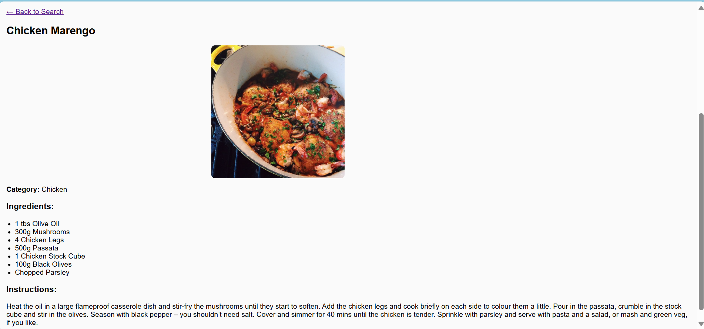

# Recipe Finder

Recipe Finder is a web application built with React that allows users to search for recipes by ingredients, cuisine, or dish name. Easily discover new recipes and get inspired to cook delicious meals!

## Features

- Search for recipes by keyword or ingredient
- View detailed recipe instructions and ingredients
- Responsive and user-friendly interface
- Fast and dynamic search experience

## Screenshot





## Getting Started

### Prerequisites

- Node.js (v14 or higher)

### Running the App

```bash
npm start
```

The app will run at [http://localhost:3000](http://localhost:3000).

## Technologies Used

- React
- CSS Modules / Styled Components
- Fetch API / Axios


